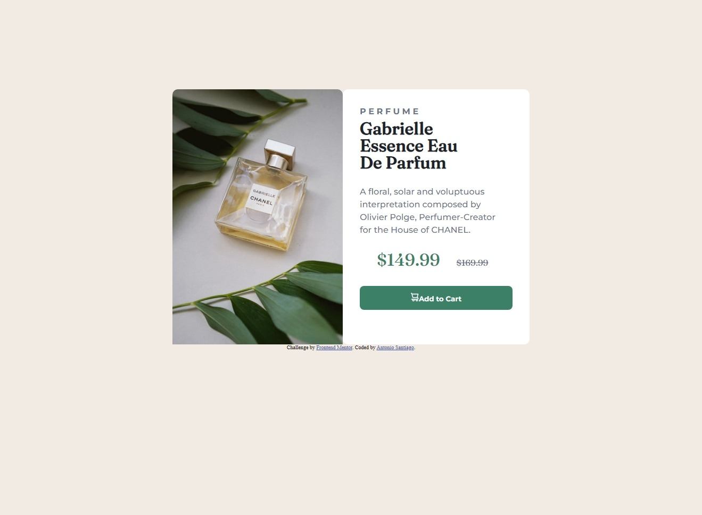

# Frontend Mentor - Product preview card component solution

This is a solution to the [Product preview card component challenge on Frontend Mentor](https://www.frontendmentor.io/challenges/product-preview-card-component-GO7UmttRfa). Frontend Mentor challenges help you improve your coding skills by building realistic projects. 

## Table of contents

- [Overview](#overview)
  - [The challenge](#the-challenge)
  - [Screenshot](#screenshot)
  - [Links](#links)
- [My process](#my-process)
  - [Built with](#built-with)
  - [What I learned](#what-i-learned)
  - [Continued development](#continued-development)
- [Author](#author)


## Overview

### The challenge
Users should be able to:
- View the optimal layout depending on their device's screen size
- See hover and focus states for interactive elements

### Screenshot



### Links
- Solution URL: [https://github.com/Ablueremote/product-preview-card-component-main.git]
- Live Site URL: [https://ablueremote.github.io/product-preview-card-component-main/]

## My process 
 - I started with a flexbox to get my initial layout. 
 - Added colors to my container and background.
 - Imported both images (product + cart icon) & 2 font types from google fonts.
 - added image to my flexbox
 - added text to my 2 element in flexbox
 - styled my text elements, padding & spacing
 - created cart button w/ cart icon
 -  started mobile design (maxwidth response) + changed flexbox to column
 - adjusted element sizing in new flexbox

### Built with

- Semantic HTML5 markup
- CSS custom properties
- Flexbox

### What I learned

- Flexbox was easier to manipulate in this project.
- How to import multiple fonts
- Manipulate images for different sizes/ mobile layout
- style different elements with different colors for added flair

<h1>Some HTML code I'm proud of</h1>
```
<p class="price-1">$149.99 <span class="price-2">$169.99 </span> </p>
```
@media only screen and (min-width: 320px) and (max-width: 576px) {
    body {
        margin: 1rem;
        padding-top: 0;
    }
```

### Continued development

- Using flexbox and getting more comfortable manipulating elements
- sizing elements and placing them where I want
- creating and adding unique styles to my web pages

## Author

- Website - [COMING SOON]
- Frontend Mentor - [@ablueremote](https://www.frontendmentor.io/profile/Ablueremote)
- Twitter - [@ablueremote](https://www.twitter.com/ablueremote)
